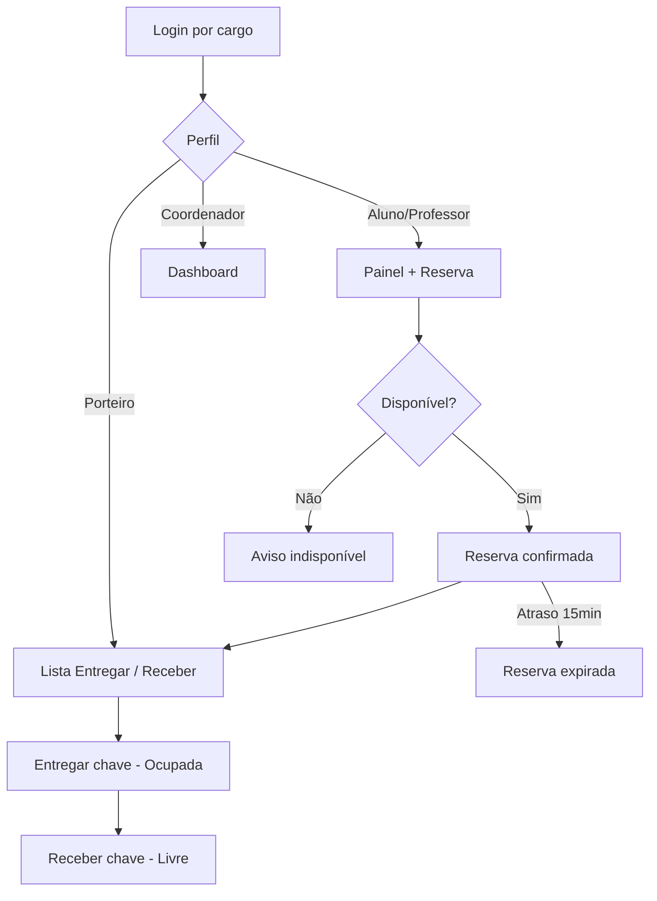

# Proposta Chave Fácil — Resumo para apresentação (10 min)

## Problema (processo atual — caderno na guarita)

- Rasuras, perda de histórico, impossível saber quem tem a chave sem ir à guarita.
- Porteiro troca de turno sem visão das chaves retiradas.
- Coordenação sem dados de demanda/ociosidade.

## Solução (fluxo **Chave Reservation** — digitalizado)

**Decisão de UX:** sem QR Code — busca por nome/ID e botões grandes (persona João, 54 anos).

## O que o MVP entrega hoje

| Persona | Rota | Função |
|---------|------|--------|
| Todos | `/painel` | Status livre/ocupado + responsável |
| Aluno/Professor | `/reservar` | Agendamento com checagem de conflito |
| Porteiro | `/porteiro` | Entregar / Receber chave |
| Coordenador | `/coordenador` | Gráficos + histórico |

## Tecnologias (ADR resumido)

- **Next.js 15** — uma aplicação, deploy simples (Vercel).
- **PostgreSQL + Prisma** — histórico e relatórios em SQL.
- **Tailwind + shadcn** — UI acessível, mobile-first, fonte ampliável (A / A+ / A++).

Detalhes: [ADR-001-stack.md](./ADR-001-stack.md)

## Viabilidade (1 slide)

| Critério | Resultado |
|----------|-----------|
| Técnica | Alta |
| Econômica | Alta (R$ 0 infra MVP) |
| Operacional | Média (treino porteiro 1–2 h) |
| Temporal | Alta (MVP 3–4 semanas) |

Detalhes e custos: [ANALISE-VIABILIDADE.md](./ANALISE-VIABILIDADE.md)

## Demo ao vivo

1. Login porteiro CPF `12345678901`
2. Aluno `2024001234` reserva LAB-01
3. Porteiro entrega → painel mostra **Ocupada**
4. Porteiro recebe → **Livre**
5. Coordenador `7654321` vê gráficos

## Próximos passos pós-MVP

- Cadastrar 152 salas: `npm run db:seed:all-rooms`
- Cron para expirar reservas sem acesso à página
- Autenticação institucional (SSO) e LGPD formal
